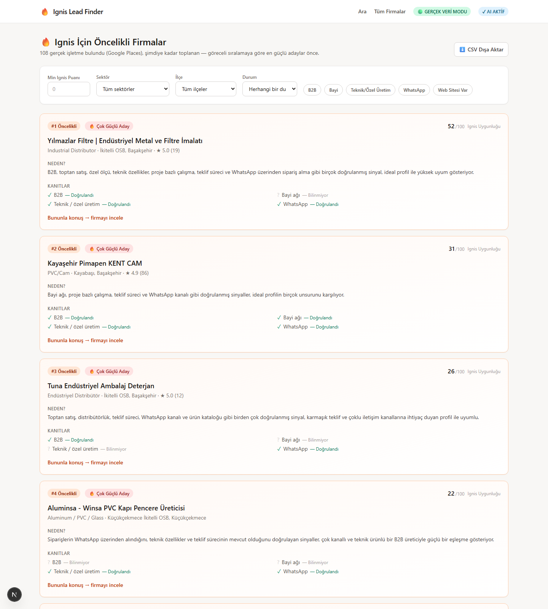
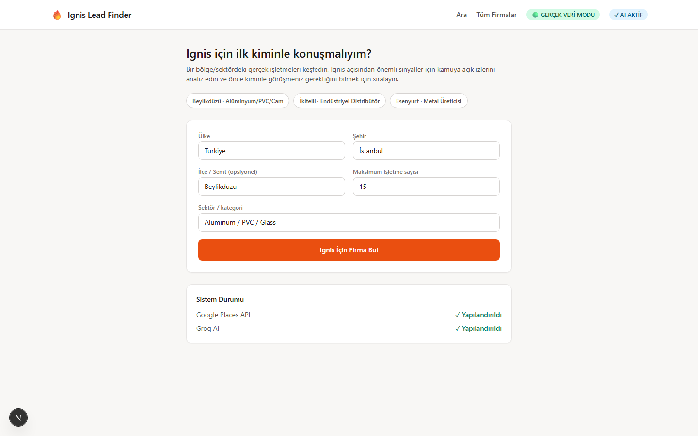
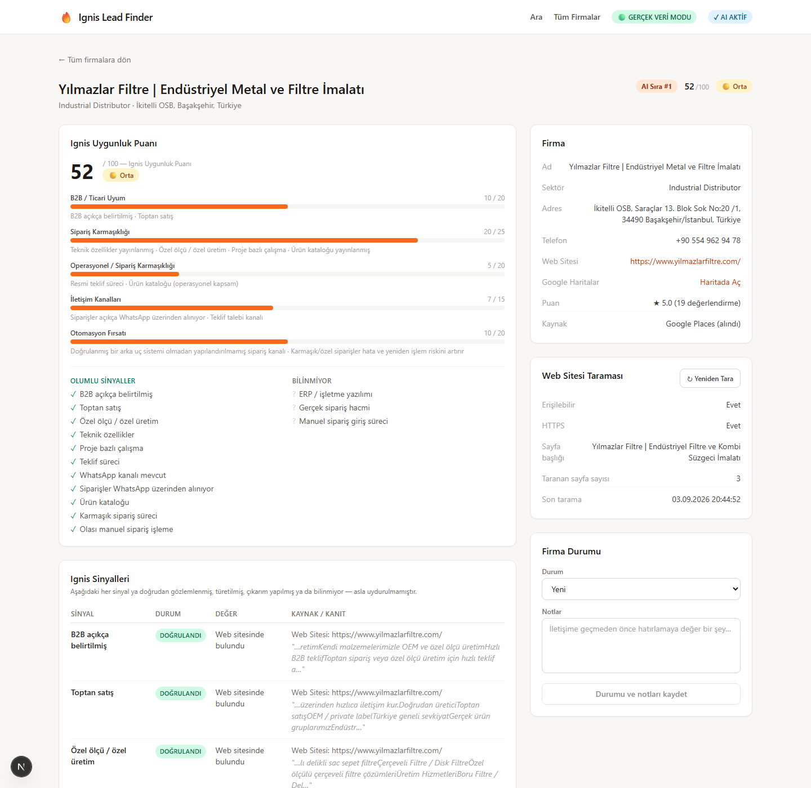

# 🔥 Ignis Lead Finder

**"Which company should I contact first, and what evidence makes it worth contacting?"**

An internal B2B lead-discovery tool built for Ignis (see below) — it finds real businesses in a location/industry via Google Places, reads their public website like a human researcher would, and ranks them by how well they match an ideal customer profile. No fake data, no invented facts, no black-box score: every claim on screen traces back to a specific sentence on a specific page, or is explicitly labeled unknown.

<p align="center">
  
</p>

---

## 🧩 What is Ignis?

Ignis is an early-stage startup idea: helping B2B manufacturers, distributors, and dealer networks catch missing or conflicting information in incoming orders before it becomes a costly mistake — and eventually, moving validated orders straight into their existing operational systems.

Ignis is still in the **customer-discovery stage** — before writing a line of the actual product, the question is *who has this problem badly enough to talk about it?* That's what this tool answers. It is not Ignis; it's the internal instrument used to find the first 10 conversations worth having.

## 🎯 Why this exists

Manually searching Google Maps for "aluminum manufacturers in Beylikdüzü," opening 30 tabs, and guessing which ones look like a real B2B operation doesn't scale and isn't repeatable. This tool automates the *research*, not the *judgment*:

1. **Discover** real businesses for a location + industry via the Google Places API.
2. **Read** each one's actual website — homepage plus a couple of relevant pages (dealer/about/contact) — the way a human would skim it.
3. **Extract evidence**, not guesses: does the site *say* it has a dealer network, custom production, WhatsApp ordering, an ERP? Every hit keeps its source URL and the exact sentence it came from.
4. **Score deterministically** — a transparent, auditable rules table turns evidence into a 0–100 fit score. No LLM anywhere near the math.
5. **Rank relatively** — the real question isn't "is this company above 80?", it's "which of the companies I just found are the strongest candidates?" A search where the best score is 24/100 still surfaces a clear #1 pick instead of reporting that everything is bad.
6. **Explain with AI, grounded in step 3** — an LLM (Groq) compares the top candidates and writes a one-sentence reason per lead, explicitly forbidden from inventing a score or a fact that isn't in the evidence.

## 📸 Screenshots

<table>
<tr>
<td width="50%">

**Search**
Country/city/district/industry — plus one-click presets for the three neighborhoods this was built to cover first.



</td>
<td width="50%">

**Ranked results**
Top candidates lead with a rank, a relative strength label, the AI's one-line reason, and a quick evidence checklist — everything else is a secondary table below.


</td>
</tr>
</table>

**Lead detail — full evidence trail**

Every category of the score, every signal (verified / inferred / unknown, with its source sentence), the live website scan, and on-demand AI generation (explanation, discovery questions, outreach message) for this specific lead.

<p align="center">
  
</p>

## ⚙️ How it works

```
Google Places  →  Real businesses  →  Website scan  →  Evidence (verified/inferred/unknown)
                                                              ↓
                                          Deterministic Ignis Fit Score (0–100)
                                                              ↓
                                      Top candidates → Groq AI ranking + rationale
                                                              ↓
                                                  Ranked leads, ready to contact
```

**The score never comes from an LLM.** `scoringEngine.ts` is a plain rules table: five weighted categories (B2B fit, order complexity, operational complexity, channel complexity, automation opportunity) that sum specific evidence points to exactly 100. Groq only enters the picture *after* the score exists — to compare already-scored candidates and explain the ranking in a sentence, never to invent a number.

**Nothing is faked when a credential is missing.** There's no "demo mode" that silently swaps in mock businesses or a template AI reply. If `GOOGLE_MAPS_API_KEY` isn't set, the search button is disabled with an explicit reason. If `GROQ_API_KEY` isn't set, the "Generate" buttons are disabled the same way — the rest of the page (real data, real score, real evidence) still works fine.

## 🛠 Tech stack

| | |
|---|---|
| **Framework** | Next.js 15 (App Router, Route Handlers) + TypeScript |
| **UI** | React 19, Tailwind CSS |
| **Database** | SQLite via Node's built-in `node:sqlite` — zero native compilation |
| **Business data** | Google Places API (New) — Text Search |
| **AI** | Groq (`openai/gpt-oss-120b`) — ranking rationale, lead summaries, discovery questions, outreach drafts |
| **Website analysis** | `cheerio` — lightweight, bounded (homepage + ≤2 relevant sub-pages) |

## 🚀 Getting started

```bash
npm install
cp .env.example .env.local
# edit .env.local — see table below
npm run dev
```

Open **http://localhost:3000**.

| Variable | Required for | Where to get it |
|---|---|---|
| `GOOGLE_MAPS_API_KEY` | Business discovery (Places API, New) | Google Cloud Console → enable *Places API (New)* → create a key |
| `GROQ_API_KEY` | AI ranking rationale, lead summary, discovery questions, outreach draft | [console.groq.com](https://console.groq.com) |
| `GROQ_MODEL` *(optional)* | — | Defaults to `openai/gpt-oss-120b` |
| `APP_ACCESS_TOKEN` *(optional)* | Basic API protection beyond localhost | Any secret string; required as an `x-ignis-token` header when set |

All provider calls happen server-side — nothing above ever reaches the browser. Restart the dev server after editing `.env.local`.

**No API keys yet?** The app still runs and tells you exactly what's missing (a "System Status" panel on the search page, plus header badges) instead of pretending to work. Set `BUSINESS_PROVIDER=mock` for an explicit, clearly-labeled offline mode with sample data — useful for UI work, never the default.

**Try it for real** with one of the three searches this was built and tested against:

```text
Turkey → Istanbul → Beylikdüzü → Aluminum / PVC / Glass
Turkey → Istanbul → İkitelli   → Industrial Distributor
Turkey → Istanbul → Esenyurt   → Metal Manufacturer
```

## 🏗 Architecture

```
src/
  lib/
    config.ts                     Single source of truth for "is a real provider actually usable right now"
    providers/businessDiscovery/  Provider interface + Google Places & mock implementations
    websiteAnalyzer.ts            Fetches homepage + relevant sub-pages, bounded & time-boxed
    signalDefinitions.ts          The canonical evidence dictionary (phrases + proximity fallbacks)
    signalExtractor.ts            Raw page text -> evidence log (verified / inferred / unknown)
    scoringEngine.ts              Evidence -> deterministic Ignis Fit Score (no LLM)
    relativeRanking.ts            Score -> relative candidate strength within THIS search's results
    aiClient.ts                   Sole entry point into Groq -- every other module calls through this one file
    aiRankingService.ts           Second-stage: compares top candidates, ranks + explains (never re-scores)
    aiLeadAnalyzer.ts             Grounded lead summary + discovery questions
    outreachGenerator.ts          Grounded personalized outreach draft
    leadRepository.ts             SQLite persistence, filtering, ranking cache
    searchPipeline.ts             Orchestrates discover -> upsert -> analyze, skipping re-analysis of known leads
  app/
    page.tsx                      Search + System Status
    leads/page.tsx                Priority cards + secondary table + filters + CSV export
    leads/[id]/page.tsx           Full evidence trail + on-demand AI generation
    api/                          Route handlers (503 when a provider isn't configured, never a fake fallback)
```

## 🧭 Design principles

- **Evidence over inference.** Every signal is `VERIFIED` (found on a page, source + snippet kept), `INFERRED` (derived from other verified signals, labeled as such), or `UNKNOWN` — never silently assumed to be "no."
- **Ranking over absolute scoring.** The point isn't "is this lead good in the abstract," it's "who do I call first out of the ones I just found."
- **Deterministic where it counts, AI where it adds judgment.** Scoring math is a plain rules table you can audit line by line. AI only interprets and explains evidence that already exists.
- **Fail loud, never fake.** A missing API key disables the relevant button with a reason — it never triggers a silent fallback to sample data.
- **Small on purpose.** No CRM, no automated outreach sending, no multi-tenant SaaS scaffolding. This is a research instrument for one person's customer-discovery process, kept exactly that size.
